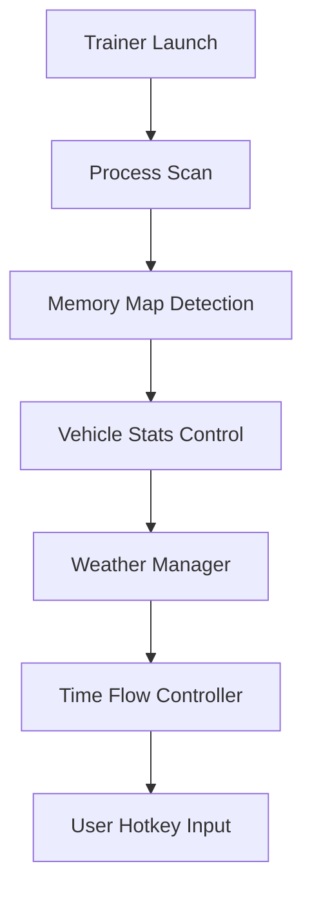

# RV There Yet? Trainer – Complete Vehicle & World Control 🚐

Turn your cross-country adventure into a customizable journey with the **RV There Yet? Trainer**, a lightweight enhancement tool built for power users and casual travelers alike. Whether you want infinite fuel, faster drives, or cinematic weather transitions, this trainer gives you the tools to shape your perfect expedition — no mods, no scripting, just real-time control.

Simple to install, safe to run, and endlessly fun to tweak.

---

## 🧭 Overview

**RV There Yet? Trainer** is an external control tool designed for full compatibility with the latest *RV There Yet?* update on Steam and Epic. It provides instant toggles for physics adjustments, fuel handling, environmental settings, and vehicle boosts.

Unlike traditional mod menus, it uses secure memory mapping to apply live edits safely — no risk of save corruption or system lag.

> [!NOTE]
> This trainer works fully offline and does not interact with online services, ensuring stable performance and full privacy.

---

## ⚙️ Key Features

### 🚗 Vehicle Mastery

* Infinite fuel toggle (`F1`)
* No damage mode (`F2`)
* Instant repair & clean function
* Adjustable engine power, acceleration, and braking torque
* Custom top-speed multiplier (up to 5x)

### 🌤 Environment & Time

* Real-time weather switch (`F5`): Clear, Rain, Storm, Night
* Freeze or accelerate in-game time (1x–10x)
* Toggle day/night instantly for cinematic shots
* Sync lighting to system time

### 🛣 Travel Shortcuts

* Teleport between map zones instantly
* Auto-drive mode (AI navigation)
* Disable collision detection for smoother testing
* Save up to 5 map checkpoints

### 🔧 Gameplay Tweaks

* Adjust RV weight physics (realistic vs arcade)
* Disable fatigue system for longer sessions
* Quick save/load travel states (`F9` / `F10`)

---

## 🪟 Compatibility

| Platform               | Status | Notes                         |
| ---------------------- | ------ | ----------------------------- |
| **Windows 10 / 11**    | ✅      | Fully supported               |
| **Steam Version**      | ✅      | Tested with latest patch      |
| **Epic Games Version** | ⚙️     | Works after manual path setup |
| **Controllers**        | ✅      | Hotkey remapping supported    |

> [!IMPORTANT]
> Always launch the game first, then activate the trainer to ensure values sync correctly with memory offsets.

---

## ⚡ Setup Instructions

1. **Download** and extract `RVTrainer.zip`
2. **Run** `rv_trainer.exe` as Administrator
3. **Start** your game
4. Wait for “Game Detected” confirmation
5. Use hotkeys to activate features:

| Hotkey | Function                 |
| ------ | ------------------------ |
| F1     | Infinite Fuel            |
| F2     | No Damage                |
| F3     | Engine Boost             |
| F4     | Teleport to Saved Marker |
| F5     | Weather Toggle           |
| F6     | Time Freeze              |
| F9     | Save Position            |
| F10    | Load Position            |

Command-line example for quick tuning:

```bash
rvtrainer.exe --boost=2.0 --weather=sunny --time_speed=3
```

To save a full preset:

```bash
rvtrainer.exe --save-profile="coast_run.cfg"
```

---

## 🧭 Trainer Operation Flow



---

## 🧩 Advanced Settings

| Parameter        | Description             | Range                   | Default |
| ---------------- | ----------------------- | ----------------------- | ------- |
| `boost`          | Engine power multiplier | 1–5                     | 1.5     |
| `fuel_usage`     | Fuel drain rate         | 0–100                   | 25      |
| `weather`        | Force weather condition | sunny, rain, fog, night | sunny   |
| `time_speed`     | Time acceleration rate  | 1–10                    | 1       |
| `damage_control` | Vehicle damage toggle   | on/off                  | off     |

> [!TIP]
> Combine `boost=3` with `damage_control=on` for fast cinematic highway drives with zero risk.

---

## ❓ FAQ

**Q1: Does the trainer affect game saves?**
No — it only modifies live memory. Saves remain intact and return to default values after restart.

**Q2: Can I use this on older versions?**
Yes, but offsets may require manual re-linking through `offsets.ini`.

**Q3: Is it compatible with reshade or visual mods?**
Completely — it runs externally and doesn’t affect rendering pipelines.

**Q4: Can I change hotkeys?**
Yes, edit the `hotkeys.ini` file to rebind any action.

**Q5: Is it safe to use online?**
This trainer is intended for single-player and sandbox use only. It does not sync with online sessions.

---

## 🧠 Example Presets

**Cinematic Mode (Smooth Travel)**

```cfg
boost=1.8  
weather=sunset  
time_speed=2  
fuel_usage=5  
damage_control=on
```

**Speedrun Mode (Maximum Boost)**

```cfg
boost=4.5  
weather=clear  
fuel_usage=0  
time_speed=5  
damage_control=on
```

---

## 🚀 Final Thoughts

The **RV There Yet? Trainer** lets you redefine how you experience the open road. Whether you’re testing routes, creating content, or just enjoying endless freedom, it delivers precise control with effortless stability.

Drive beyond limits — and make every journey your own.

---
